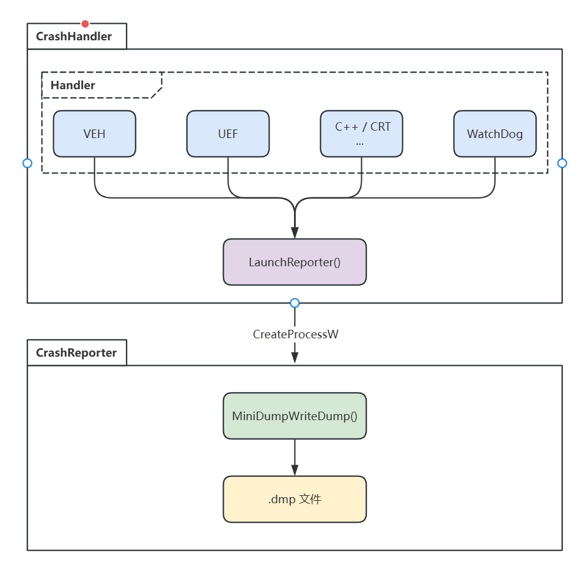

# Dump 生成方案升级调研

## 1. 背景与目标

DGM内核为单进程式设计，内部存在多线程计算模块。

在客户现场 Windows Release 环境下，程序偶发崩溃时生成的 `.dmp` 文件大小为 **0 字节**或**完全未生成**，导致事后分析工作陷入瘫痪。

**核心目标**：

1. **全覆盖**：无论程序以何种方式崩溃（包括栈溢出、堆损坏、纯虚调用、`std::terminate` 等），都能安全、可靠地生成 Dump 文件。
2. **可分析**：生成的 Dump 必须包含足够信息，能够完整展开调用栈并查看关键变量，准确定位崩溃位置。
3. **生产可用**：方案需兼顾客户现场的磁盘、网络资源限制，并提供灵活的 Dump 详细程度控制。

## ~~2. 原方案局限性分析~~

~~需结合内核进行测试~~

## 3. Windows内核异常机制

### 3.0 异常

异常通常是CPU在执行指令时因为检测到预先定义的某个(或多个)条件而产生的同步事件，是CPU主动产生的。

- Windows会给每个异常最多两轮被处理的机会：

  - **第一轮**：先尝试发给调试器，如果调试器没有处理，则遍历并依次调用异常处理器。
    - 如果返回EXCEPTION_EXECUTE_HANDLER，则表示它已经处理了异常，并让系统**重新执行**因为异常而中断的代码；
    - 如果返回EXCEPTION_CONTINUE_SEARCH，则表示它不能处理该异常，并让系统**继续寻找**其他的异常处理器。
  - **第二轮**：再次发给调试器，如果还没有处理，则通过KeBugCheckEx触发蓝屏。

- 只有在第一轮分发时，才会把异常分发给用户代码注册的异常处理器，**进入到第二轮分发的异常**都属于未处理异常。

- 根据程序的运行模式，把发生在驱动程序等内核态模块中的未处理异常称为**内核态的未处理异常**，把发生在应用程序中的未处理异常称为**用户态的未处理异常**。

  - 内核态的未处理异常：
  
    - 若有内核调试器存在：系统(KiExceptionDispatch)会给调试器第二轮处理机会；
    - 若调试器没有处理该异常或者根本没有内核调试器：系统便会调用KeBugCheckEx发起蓝屏机制，报告错误并停止整个系统，其停止码为`KMODE_EXCEPTION_NOT_HANDLED`。
  
  - 用户态的未处理异常：
    - 使用**系统登记的默认异常处理器**来处理。
- Windows内核底层原理参考（https://www.cnblogs.com/onetrainee/p/11675224.html）

### 3.1 **Debugger (First Chance Exception)**

- **中文**：调试器优先异常（第一次机会异常）
- **注册方式**：由调试器（如 WinDbg、Visual Studio）在附加进程时自动接管，无需用户代码注册
- **职责**：开发阶段的**主动控制与诊断**。
- **特点**：
  - 优先级**最高**，在内核分发异常后第一个获得通知。
  - 调试器可以选择处理异常（`DBG_EXCEPTION_HANDLED`）并恢复执行，或继续搜索 VEH/SEH。
  - 可通过 `IsDebuggerPresent()` / `CheckRemoteDebuggerPresent()` 检测是否被调试。
  - 生产环境（未附加调试器）下通常不触发。
- **返回值**（调试器内部）：
  - `DBG_EXCEPTION_HANDLED`：异常已处理，程序继续运行。
  - `DBG_EXCEPTION_NOT_HANDLED`：继续分发异常给 VEH/SEH。
- **典型用途**：逆向分析、开发阶段断点、单步调试、实时诊断。

### 3.2 **VEH（Vectored Exception Handler）**

- **中文**：向量化异常处理器
- **注册方式**：`AddVectoredExceptionHandler(First, Handler)`
- **职责**：**监控或修复**异常。
- **特点**：
  - **最早**被调用（先于 SEH和 WER）。
  - 可以注册**多个**，参数中的 `First` 表示处理程序的调用顺序
    - **`0`**：成为当前已注册 VEH 中**最后一个**要调用的处理程序；
    - **`1`**：成为当前已注册 VEH 中要调用的**第一个**处理程序。
  - **全局生效**（不限于当前模块），所有线程共享。
  - 可以捕获很多 SEH 无法捕获的异常（如早期栈溢出）。
- **返回值**：
  - `EXCEPTION_CONTINUE_SEARCH`：我不处理，继续往下传（最常见）。
  - `EXCEPTION_CONTINUE_EXECUTION`：我已处理，重新执行。
- **典型用途**：崩溃捕获、反调试、异常监控。

### 3.3 SEH（Structured Exception Handling）

- **中文**：结构化异常处理
- **注册方式**：`__try { } __except(filter) { }` 或 `__try { } __finally { }`
- **职责**：**局部异常保护**与**资源清理**。
- **特点**：
  - **基于线程栈**，每个函数内的 `__try` 块会在栈上注册一个 SEH 节点，多个节点形成链表。
  - 当异常未被 VEH 或调试器处理后，系统遍历当前线程的 SEH 链表。
  - 每个 `__except` 块可包含**过滤器表达式**，决定是否处理该异常。支持**栈展开**（unwinding）：处理异常后，会展开中间栈帧，调用 `__finally` 块
  - 是 Windows 最传统、最常用的异常机制。
  - C++ 的 `try/catch` 也是通过 SEH 实现的（编译器封装）。
  - **不能跨模块传播**（需要 DLL 边界适配），且如果栈损坏或堆损坏，SEH 可能无法正常工作。

- **返回值**（过滤器表达式）：
  - `EXCEPTION_EXECUTE_HANDLER`：执行 `__except` 块中的代码，然后从 `__except` 后继续。
  - `EXCEPTION_CONTINUE_SEARCH`：不处理，继续寻找下一个 SEH 帧。
  - `EXCEPTION_CONTINUE_EXECUTION`：重新执行引起异常的指令（很少用）。
- **典型用途**：保护特定代码段（如内存访问、除零）、局部错误处理、资源清理（`__finally`）。

### 3.4 VCH（Vectored Continue Handler）

- **中文**：向量化继续处理器
- **注册方式**：`AddVectoredContinueHandler(First, Handler)`
- **职责**：**异常处理后**的通知与后处理
- **特点**：
  - 与 VEH 类似，但调用时机不同：**在异常被某个处理器处理完毕、即将恢复执行之前**被调用。
  - 仍然可以注册多个，`First` 参数控制顺序（1 优先，0 最后）。
  - 注意：这个机制并不常用，且只在**异常被处理后**才触发，**不能用于捕获未处理异常**。
- **返回值**：
  -  `EXCEPTION_CONTINUE_EXECUTION`：恢复执行；
  -  `EXCEPTION_CONTINUE_SEARCH`：继续调用下一个 VCH。
- **典型用途**：调试器中的“继续处理”钩子、异常修复后的日志记录。

### 3.5 WER（Windows Error Reporting）

- **中文**：Windows 错误报告
- **注册方式**：系统服务，无需用户代码注册（无法直接注册 Handler）；可通过注册表配置行为。
- **特点**：
  - 当 UEH 未处理（或未注册）时，系统自动调用 WER。
  - “程序已停止工作”对话框，询问用户是否发送报告或终止程序。
  - WER 会生成一个**轻量级 Dump**（通常很小，可能不包含完整栈），大小和行为可通过注册表 `LocalDumps` 键控制。
  - 默认生成的 Dump 可能为 0 字节（如果堆栈已损坏或权限不足）。
  - 从 Windows 8.1 开始优先级被大幅提升，与UEH / UEF异步进行。
- **返回值**：
  - 无直接返回值，由系统决定是否显示界面和生成报告。
- **典型用途**：向微软或内部服务器报告崩溃，生成基本转储。
- **注**：
  - 可以借助这个特性，仅通过注册表配置，系统自动在程序崩溃时生成完整的 `.dmp` 文件。无需写任何代码，但比任何通过代码的方式都能够稳定生成dmp文件。
  - `HKEY_LOCAL_MACHINE\SOFTWARE\Microsoft\Windows\Windows Error Reporting\LocalDumps`
  - 可指定 dmp 保存目录、指定保留最近几个 dmp 文件、指定转储信息大小。

### 3.6 UEH / UEF（Unhandled Exception Filter）

- **中文**：未处理异常过滤器
- **注册方式**：`SetUnhandledExceptionFilter(Filter)`
- **职责**：**程序终止前**的最后防线，结束或记录现场
- **特点**：
  - **全局唯一**（后设置的会覆盖之前的）。
  - 当异常遍历完所有 VEH 和 SEH 都无人处理时，系统调用该过滤器。
  - 这是程序在进程终止前**最后的机会**执行清理或生成 Dump。
  - 与 VEH 不同，UEH 不接收异常上下文（`EXCEPTION_POINTERS`），但可通过其他方式获取。
- **返回值**：
  - `EXCEPTION_EXECUTE_HANDLER`：系统执行默认处理（终止进程）。
  - `EXCEPTION_CONTINUE_SEARCH`：继续搜索（但通常已无后续，会回到默认行为）。
- **典型用途**：最后一道防线，生成 Dump、记录日志、重启进程。

### 3.7 其他 C++ / CRT 死亡路径（非 Windows 原生异常）

这些机制不在 VEH/SEH 链中，但程序崩溃时同样会终止进程，需要额外钩子来处理。

#### 3.7.1 `std::terminate` / `set_terminate`

- **中文**：C++ 终止处理器
- **注册方式**：`std::set_terminate(handler)`
- **触发场景**：
  - 未捕获的 C++ 异常传播到 `main` 之外（在 `throw` 异常却没有对应 `catch` 时被调用）。
  - 析构函数中抛出异常。
  - 函数声明 `noexcept` 但抛出异常。
  - 直接调用 `std::terminate()`。
- **特点**：默认行为是调用 `abort()`，可自定义处理（如生成 Dump）。
- **典型用途**：捕获 C++ 未处理异常并生成 Dump。

#### 3.7.2 纯虚函数调用（`_purecall_handler`）

- **中文**：纯虚函数调用处理器
- **注册方式**：`_set_purecall_handler(handler)`
- **触发场景**：通过基类指针调用一个未实现的纯虚函数（常见于对象已销毁或构造函数/析构函数中误调用）。
- **特点**：默认会终止进程，可自定义函数来生成 Dump。
- **典型用途**：防止静默崩溃，生成转储分析调用方。

#### 3.7.3 无效参数处理器（`_invalid_parameter_handler`）

- **中文**：无效参数处理器
- **注册方式**：`_set_invalid_parameter_handler(handler)`
- **触发场景**：CRT 函数（如 `fopen`、`memcpy`）在 Release 模式下检测到参数无效（如空指针、越界）。
- **特点**：默认行为是调用 `abort()`，可自定义处理，避免崩溃时无 Dump。
- **典型用途**：捕获参数错误并生成 Dump。

#### 3.7.4 C 信号（`signal`）

- **中文**：C 信号处理器
- **注册方式**：`signal(signal_number, handler)`
- **触发场景**：
  - `SIGABRT`：调用 `abort()`。
  - `SIGFPE`：浮点异常。
  - `SIGSEGV`：段违例（与 SEH 交集，但通常 SEH 先处理）。
  - `SIGTERM`：终止请求。
- **特点**：CRT 层模拟，实际底层依赖 SEH。但如果 SEH 被屏蔽，信号处理仍可工作。
- **典型用途**：捕获 `abort()` 或简单的终止信号。

## 4.新方案架构设计

### 4.1 核心设计原则

- **不在崩溃现场写 Dump**：使用独立进程（`CrashReporter.exe`）跨进程生成 Dump。
- **全覆盖死亡路径**：同时挂接 VEH、UEF、C++ `terminate`、`purecall`、`invalid parameter`、C 信号等全部钩子。
- **分级 Dump 策略**：提供 Light / Normal / Full 三级可选，平衡信息量与文件体积。
- **备用栈支持**：利用 `SetThreadStackGuarantee` 为栈溢出异常预留运行空间。
- **看门狗监控**：独立线程监控主线程心跳，捕获死循环/死锁等无异常崩溃。

### 4.2 组件架构图

### 4.3 异常捕获层次

以**空指针访问**为例，新方案中的完整调用链如下：

1. CPU 触发页错误 → 内核构建 EXCEPTION_RECORD (0xC0000005) 并分发

2. VEH 链表被遍历：
   →  VectoredHandler 被调用
   → 检测到非断点异常，调用 LaunchReporter(ex)
   → 返回 EXCEPTION_CONTINUE_SEARCH 

3. 如果存在 `__try/__except`块，且选择了处理，则执行 `__except` 代码，异常结束。
   （在我们的测试菜单中，没有 `__try/__except`，所以继续向下）

4. 则调用 UEF：
   → TopLevelFilter 被调用
   → 再次调用 LaunchReporter(ex) 
   → 返回 EXCEPTION_EXECUTE_HANDLER 

6. 进程退出。

**设计意图**：

- **VEH 提供最早介入点**：确保即使业务代码有 `__try/__except` 且捕获了异常，我们仍然能拿到一份“第一现场”的 Dump（因为 VEH 在 `__except` 之前运行）。这对调试那些被内部 catch 掩盖的 bug 极其有用。
- **UEF 作为最终保险**：如果 VEH 因为某种原因未能启动 Reporter（例如 VEH 链表被破坏），UEF 仍然会尝试。

## 5. 死亡路径覆盖验证矩阵

| 崩溃类型                      | 模拟方式                          | 新方案表现               | 新方案捕获路径                                               |
| ----------------------------- | --------------------------------- | ------------------------ | ------------------------------------------------------------ |
| **空指针访问**                | `*(int*)0 = 0`                    | ✅ 必定生成               | VEH → UEF                                                    |
| **栈溢出**                    | 无限递归                          | ✅ 必定生成               | 栈溢出 VEH + 备用栈 → UEF                                    |
| **堆损坏（UAF）**             | 写已释放内存                      | ✅ 必定生成               | VEH  → UEF                                                   |
| **未捕获 C++ 异常**           | `throw std::runtime_error`        | ✅ 必定生成               | VEH → Catch                                                  |
| **纯虚函数调用**              | 野指针调用抽象基类虚函数          | ✅ 必定生成               | VEH → UEF 某些编译器会触发PureCallHandler               |
| **`abort()`**                 | `std::abort()`                    | ✅ 必定生成               | SignalHandler                                                |
| **CRT 函数**                  | fopen("file.txt", "z");           | ✅ 必定生成               | WER中止：SignalHandler WER重试：VEH  → UEF WER忽略：InvalidParameterHandler → SignalHandler |
| **双重释放**                  | delete p; delete p;               | ✅ 必定生成               | VEH → UEF                                                    |
| **`noexcept` 函数内抛出异常** | void func() noexcept { throw 1; } | ✅ 必定生成               | VEH → TerminateHandler → SignalHandler                       |
| **多线程工作线程崩溃**        | 线程内空指针                      | ✅ 生成完整多线程 Dump    | VEH → UEF                                                    |
| **DLL 内崩溃**                | DLL 内空指针                      | ✅ 必定生成               | VEH → UEF                                                    |
| **主线程死循环/死锁**         | `while(true){}`                   | ✅ 超时后生成 Dump 并终止 | 看门狗线程超时触发                                           |

**验证结论**：新方案覆盖了所有已知的程序死亡路径，并在高危场景（栈溢出、堆损坏）下保持 100% 生成成功率。

## 6. Dump 详细程度分级策略

为了在客户现场平衡信息完整性与资源消耗，新方案支持三级 Dump 配置：

| 级别           | MINIDUMP_TYPE 组合                                           | 包含内容                               | 典型大小                  | 适用场景                                      |
| -------------- | ------------------------------------------------------------ | -------------------------------------- | ------------------------- | --------------------------------------------- |
| **Light (1)**  | `MiniDumpWithIndirectlyReferencedMemory` `MiniDumpWithThreadInfo` `MiniDumpWithModuleHeaders` `MiniDumpWithUnloadedModules` | 所有线程栈、模块信息、间接引用内存     | 1~20 MB                   | 快速确认崩溃大致位置和异常类型                |
| **Normal (2)** | Light + `MiniDumpWithPrivateReadWriteMemory` `MiniDumpWithDataSegs` `MiniDumpWithHandleData` `MiniDumpWithFullMemoryInfo` | 堆内存、全局变量、句柄表、内存区域属性 | 100~500 MB                | **生产环境推荐配置**，可满足 90% 以上分析需求 |
| **Full (3)**   | Normal + `MiniDumpWithFullMemory` `MiniDumpWithTokenInformation` | 进程全部虚拟内存空间、安全令牌         | 等于进程内存占用（GB 级） | 内部疑难问题深度调试，客户现场谨慎使用        |

**注意**：
- `MiniDumpWithIndirectlyReferencedMemory` 是展开完整调用栈的关键，所有级别必须包含。
- `MiniDumpWithFullMemory` 可能导致数 GB 的 Dump，客户现场应仅在技术支持指导下临时开启。

## 7. 新方案优势与劣势分析

### 7.1 优势

| 优势点             | 说明                                                         |
| ------------------ | ------------------------------------------------------------ |
| **极高的可靠性**   | 独立进程写 Dump 规避了崩溃现场的内存/栈损坏问题。            |
| **全覆盖死亡路径** | 多种死亡路径钩子 + 看门狗，扩充捕获崩溃场景。                |
| **多线程友好**     | Normal 级别包含所有线程的栈和私有内存，支持多线程调试。      |
| **资源可控**       | 三级 Dump 策略，默认 Normal 在提供充足信息的同时保持数百 MB 的合理体积。 |
| **易于部署**       | CrashHandler 为动态库，只需在 `main()` 首行调用 `Install()`，对现有代码侵入极小。 |
| **符号兼容**       | Dump 与 PDB 完全兼容，Visual Studio / WinDbg 可直接打开分析。 |

### 7.2 劣势与注意事项

| 劣势/风险                                   | 应对措施                                                     |
| ------------------------------------------- | ------------------------------------------------------------ |
| **需要额外部署 CrashReporter.exe**          | 将 CrashReporter.exe 放入安装包，与主程序同目录即可。        |
| **看门狗超时阈值需调优**                    | 提供配置文件按需调整。                                       |
| **跨进程写 Dump 需要 `PROCESS_ALL_ACCESS`** | 正常情况下同用户进程拥有该权限；若被安全软件拦截，需加入白名单。 |

## 8 sentry-native(Crashpad)应用场景

### Crashpad

​	谷歌自有的崩溃报告客户端，作为Chromium的崩溃报告处理器，最初应用于Windows/macOS，后续逐步扩展至Android、Linux。从 Chromium 80 左右开始，Linux 构建的崩溃报告系统已从 Breakpad 转移到 Crashpad（但Chromium所使用的Crashpad与开源项目不完全相同，经过大量定制和修复）。

- **崩溃捕获**：生成跨平台的 minidump 文件，记录进程**崩溃**时的内存、寄存器、调用栈等信息。
- **进程外捕获**：独立进程处理崩溃，避免被监控进程自身损坏影响捕获成功率。
- **符号处理**：支持生成和解析符号文件，便于后续还原函数名和行号。
- **优势**：
  - 轻量，仅崩溃处理时激活进程，空闲时零开销；
  - Google 维护，更新较稳定；
- **劣势**：
  - 不包含非崩溃错误、性能追踪；
  - **只能捕获“崩溃瞬间”的快照**；
  - Crashpad 在 Linux 上采用进程外捕获时，曾出现过 `clone` 系统调用相关问题、多线程死锁等边缘 bug；
  - 需要 C++17 及以上，依赖 `mini_chromium` 基础库，对老旧 Linux 发行版或交叉编译环境可能增加复杂度；

### sentry-native

- **多级错误捕获**：不仅捕获崩溃（segfault、assert 等），还支持**手动上报消息、自定义错误事件**。
- **崩溃处理后端**：底层封装 **Crashpad**（Windows / macOS）和 **Breakpad**（Linux / 旧版 macOS），提供统一 API。
- **优势**：
  - 完整可观测性（错误、日志、性能、用户反馈）；
  - **可以捕获“崩溃前的一系列上下文”**；
  - Breakpad 使用 `ptrace` 和信号处理机制，与 Linux 内核兼容性极佳；
- **劣势**： 
  - 运行时有一定内存和 CPU 开销（用于面包屑缓存、事务追踪等）；
  - 在 Linux 下使用Breakpad 是在被监控进程内通过信号处理程序生成 minidump（**进程内**），可能存在信号处理不干净导致二次崩溃的问题；

